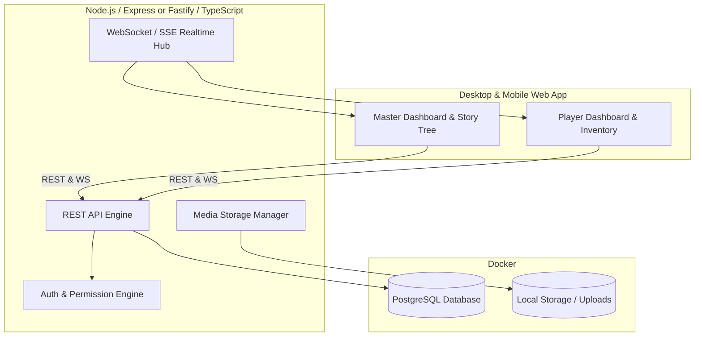
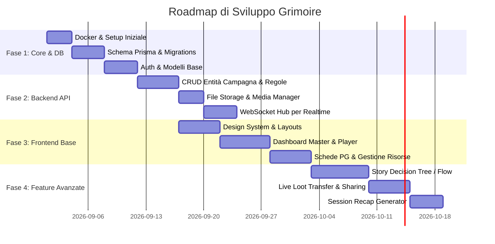

# Piano di Implementazione - Grimoire

Piano dettagliato per lo sviluppo di **Grimoire**, una piattaforma self-hosted / locale per la gestione di campagne GDR per Master e Giocatori con albero decisionale per le sessioni, gestione del loot e condivisione in tempo reale.

---

## 1. Visione d'Insieme & Architettura

Grimoire si compone di 3 livelli principali eseguiti tramite container o processi locali leggeri:

### Stack Tecnologico Consigliato
- **Database**: PostgreSQL su Docker con Prisma ORM o Drizzle ORM per schema typing e migrazioni sicure.
- **Backend**: Node.js (TypeScript) con Express o Fastify:
  - Architettura a layer: Controller -> Service -> Repository.
  - Autenticazione: JWT con ruoli (`MASTER`, `PLAYER`, `ADMIN`).
  - Realtime: WebSocket (Socket.io) o SSE per live loot transfer, sharing note/immagini e sync sessione.
- **Frontend**: Web App moderna, reattiva e responsive (Desktop & Mobile) con estetica *Grimoire / Dark Fantasy Moderna* (supporto a glassmorphism, palette scura immersiva, UI scattante).
- **Deployment**: `docker-compose.yml` one-click per avviare Database + Backend + Frontend (con supporto a tunneling/reverse-proxy es. Cloudflare Tunnel, Tailscale o ngrok per accesso esterno).

---

## 2. Modello Dati & Database Schema

### Base Model (Tratti Comuni)
Ogni entità principale estende un modello base:
- `id` (UUID / CUID)
- `createdAt`, `updatedAt`, `deletedAt` (Soft delete)
- `tags` (Array di stringhe o relazione M2M con tabella Tag)
- `campaignId` (Relazione con la campagna)
- `visibility` (`PRIVATE_MASTER`, `PUBLIC_PLAYERS`, `ASSIGNED_ONLY`)

### Entità Principali
1. **User & Auth**: `id`, `username`, `passwordHash`, `role` (`MASTER`, `PLAYER`), `avatarUrl`.
2. **Campaign**: `id`, `title`, `description`, `system` (es. D&D 5e, Pathfinder, Custom), `masterId`, `bannerUrl`, `status`.
3. **Character**: `id`, `name`, `campaignId`, `userId` (Player assegnato), `class`, `level`, `stats` (JSON flessibile per diversi sistemi), `avatarUrl`, `isNpc` (false).
4. **NPC**: Specializzazione di personaggio o entità dedicata: `id`, `name`, `role`, `locationId`, `faction`, `attitude`, `secrets` (visibili solo al Master), `portraitUrl`.
5. **Monster**: `id`, `name`, `cr`/livello, `hp`, `ac`, `stats`, `actions` (JSON/Markdown), `imageUrl`.
6. **Item & Inventory**: `id`, `name`, `description`, `rarity`, `type` (weapon, armor, potion, artifact), `value`, `weight`, `properties`, `assignedCharacterId` (nullable, per loot non ancora assegnato o posseduto).
7. **Location**: `id`, `name`, `description`, `parentId` (gerarchia: continente -> regione -> città -> dungeon -> stanza), `mapImageUrl`, `pointsOfInterest`.
8. **Quest**: `id`, `title`, `objective`, `status` (`DRAFT`, `ACTIVE`, `COMPLETED`, `FAILED`), `rewards`, `linkedNpcId`, `linkedLocationId`.
9. **Event / Timeline**: `id`, `title`, `dateInGame`, `realDate`, `description`, `importance`.
10. **Story Flow & Decision Tree (Path)**:
    - `StoryNode`: `id`, `campaignId`, `title`, `summary`, `status` (`PLANNED`, `REACHED`, `SKIPPED`, `ALTERED`), `linkedEntities` (M2M con NPC, Monsters, Locations, Items, Quests).
    - `StoryEdge`: `id`, `fromNodeId`, `toNodeId`, `choiceLabel`, `condition`.
11. **Notes & Logs**: `id`, `campaignId`, `authorId`, `title`, `content` (Markdown), `isPublic`, `sessionDate`.
12. **Media / Images**: `id`, `filename`, `mimeType`, `size`, `sourceType` (`UPLOADED`, `EXTERNAL_URL`), `url`, `altText`.

---

## 3. Funzionalità Core Dettagliate

### A. Albero Decisionale del Master (Story Flow & Prep)
- **Visual Graph / Interactive Flow**: Interfaccia a nodi interattiva in cui il Master può mappare la sessione ("I PG arrivano alla locanda" -> Opzione A: Parlano con il barista [Link NPC] -> Opzione B: Rissa con i banditi [Link Encounter/Monsters]).
- **Link Bidirezionali Cliccabili**: Cliccando su un nodo si apre una preview laterale (drawer) con i mostri pronti, statblock, mappe e dialoghi senza lasciare la pagina.
- **Session Tracking & Recap**: Durante la partita il Master clicca sui nodi percorsi; al termine della sessione il sistema genera un riassunto automatico cronologico con le scelte fatte, pronto come punto di partenza per la sessione successiva.

### B. Distribuzione del Loot & Gestione Inventario
- Il Master genera o seleziona un Item (o pacchetto di loot) e lo assegna a uno o più Player tramite drag-and-drop o dropdown.
- Notifica immediata al Player: l'item compare nell'inventario del PG.
- Il Player può:
  - Equipaggiarlo / Usarlo.
  - Trasferirlo a un compagno di party (con conferma).
  - Scartarlo / Venderlo.

### C. Live Sharing & Handouts
- Il Master può "trasmettere" in tempo reale una mappa, una lettera/nota, l'immagine di un mostro o un NPC sullo schermo di tutti i giocatori o di un giocatore specifico con un solo clic (*"Condividi con i Giocatori"*).
- I giocatori ricevono un popup o un tab dedicato *"Handouts recenti"* dove consultare le informazioni rivelate.

---

## 4. Specifiche API REST

Tutti gli endpoint prevedono autenticazione JWT, paginazione standard, filtri per `campaignId`, ricerca per tag e supporto soft-delete:

| Risorsa | Endpoints | Permessi |
|---|---|---|
| `/auth` | `POST /login`, `POST /register`, `GET /me` | Pubblico / Autenticato |
| `/campaigns` | `GET`, `POST`, `GET /:id`, `PUT /:id`, `DELETE /:id` | Master / Player assegnati |
| `/characters` | `GET`, `POST`, `GET /:id`, `PUT /:id`, `DELETE /:id` | Master (Full), Player (Proprio PG) |
| `/monsters` | `GET`, `POST`, `GET /:id`, `PUT /:id`, `DELETE /:id` | Master (Full), Player (Solo visibili) |
| `/items` | `GET`, `POST`, `GET /:id`, `PUT /:id`, `DELETE /:id` | Master (Full), Player (Inventario proprio) |
| `/items/:id/transfer` | `POST /transfer` | Master o Proprietario dell'Item |
| `/locations` | `GET`, `POST`, `GET /:id`, `PUT /:id`, `DELETE /:id` | Master (Full), Player (Luoghi scoperti) |
| `/quests` | `GET`, `POST`, `GET /:id`, `PUT /:id`, `DELETE /:id` | Master (Full), Player (Quest attive/completate) |
| `/npcs` | `GET`, `POST`, `GET /:id`, `PUT /:id`, `DELETE /:id` | Master (Full), Player (NPC incontrati) |
| `/story-nodes` | `GET`, `POST`, `PUT /:id`, `DELETE /:id`, `POST /edges` | Esclusivo Master |
| `/notes` | `GET`, `POST`, `GET /:id`, `PUT /:id`, `DELETE /:id` | Master (Tutte), Player (Proprie e pubbliche) |
| `/logs` | `GET`, `POST`, `GET /:id`, `PUT /:id`, `DELETE /:id` | Master (Tutti), Player (Log di sessione) |
| `/images` | `POST /upload`, `POST /external`, `GET`, `DELETE /:id` | Master / Player |
| `/share` | `POST /live-broadcast` | Master (Invio real-time via WebSocket) |

---

## 5. Roadmap di Implementazione per Fasi

### **Fase 1: Fondamenta & Infrastruttura Locale (v0.1)**
- [ ] Creazione configurazione `docker-compose.yml` (PostgreSQL + PgAdmin o container di supporto).
- [ ] Inizializzazione progetto Backend TypeScript (Node.js + Prisma/Drizzle).
- [ ] Definizione schema database completo con tabelle relazionali e campi di audit.
- [ ] Sistema di autenticazione e autorizzazione (JWT, RBAC).

### **Fase 2: Backend REST API & Realtime (v0.2)**
- [ ] Implementazione dei controller e servizi CRUD per tutte le 11 entità.
- [ ] Modulo di gestione immagini (upload su cartella locale persistente + metadata link esterni).
- [ ] WebSocket server per eventi live (Loot pass, broadcast di note/immagini).

### **Fase 3: Frontend Web App (Desktop & Mobile) (v0.3 - Prima Versione Giocabile)**
- [ ] Creazione Frontend con design system dark fantasy moderno, responsive.
- [ ] Vista Login / Registrazione e Selezione Campagna.
- [ ] **Board del Master minimale**: lista PG, NPC, Mostri, Oggetti, Note con filtri rapidi e toggle di visibilità.
- [ ] **Board del Giocatore minimale**: scheda PG, inventario, visualizzatore note e quest condivise.

### **Fase 4: Core Experience & Decision Tree (v1.0)**
- [ ] **Master Decision Tree (Campaign Path)**: costruttore a nodi con collegamenti rapidi a schede ed entità.
- [ ] Modalità "Live Session": navigazione del path con check-in in tempo reale e generazione recap finale.
- [ ] Sistema completo di distribuzione e scambio loot live.
- [ ] Guida per l'esposizione all'esterno (LAN, Tunneling, port forwarding).

---

## 6. Piano di Verifica e Collaudo

### Test Automatici
- **Unit & Integration Tests**: Test Jest/Vitest per endpoint API REST e logica di autorizzazione (es. verificare che un player non possa modificare entità master o accedere a note private).
- **Schema Validation**: Validazione rigorosa degli input tramite Zod sia a livello di API che di form frontend.

### Test Manuali & User Flow
- Verifica flusso Master: creazione campagna -> creazione NPC/Mostro -> creazione nodo di storia con link -> condivisione live con player.
- Verifica flusso Player: accesso tramite invito/login -> assegnazione PG -> ricezione loot -> passaggio loot ad altro PG.
- Verifica responsività mobile (smartphone/tablet durante la sessione al tavolo da gioco).
